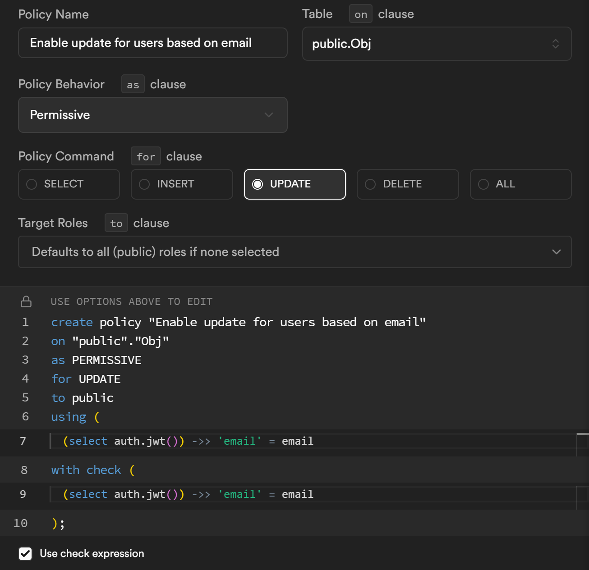
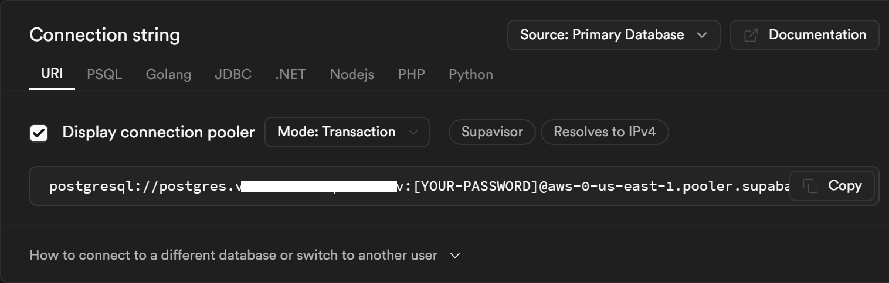

## Supabase 介绍

`Supabase` 是一个开源的后端即服务（`BaaS`）平台，旨在为开发者提供快速构建和部署应用程序所需的后端功能。`Supabase` 结合了多种现代技术，包括 `PostgreSQL` 数据库、实时数据订阅、身份验证和存储服务，使得开发者可以专注于构建前端和业务逻辑，而无需过多关注后端基础设施的搭建和维护。

## Row Level Security 介绍

行级安全性（Row Level Security，简称 `RLS`）是 `PostgreSQL` 数据库提供的一项强大功能，允许数据库管理员根据用户的身份或角色来限制对数据库表中行的访问。通过 `RLS`，可以实现细粒度的数据访问控制，确保只有授权的用户才能访问特定的数据行。

## Supabase 添加 RLS

1. 创建数据表（略）

2. 在侧边栏点击 `Authentication` -> `Policies`，打开 `Policies` 页面

3. 点击 `Enable RLS` 按钮打开 `RLS` 功能，如果已经打开则跳过

4. 点击 `Create policy` 按钮，打开创建对话框
   
   右边是规则示例，点击后会自动填充左边的表单，可以参考示例填写自己的规则
   
   
   1. Policy Name: 规则名称，用来区分不同规则
   
   2. Table: 应用规则的表格，从哪个表格打开的会自动填好，通常不用改
   
   3. Policy Behavior: 多条规则的处理方式，如果有多条 `RESTRICTIVE` 规则需要同时符合，如果有多条 `PERMISSIVE` 规则只需要其中一条符合。
   
   4. Policy Command: 应用规则的语句类型，
   
   5. Target Roles: 应用规则的角色，默认对所有角色有效
   
   6. using: 用于检索可供用户使用的数据
   
   7. with check: 用于写入（插入、更新）的时候检查数据

## Prisma 添加 RLS

### 连接字符串

打开 `Supabase` `Project Setting` -> `Database` 页面，页面上有当前项目的数据库连接字符串（下图）。复制后需要替换其中的 `[YOUR-PASSWORD]` 为创建项目时输入的数据库密码，并添加连接参数 `pgbouncer=true`，添加后类似这样 `postgresql://postgres.[projectid]:[your-password]@[host].pooler.supabase.com:6543/postgres?pgbouncer=true`。



### 安装依赖

```shell
npm install prisma-extension-rls
```

### 示例代码

```typescript
// for supabase
import { PrismaClient } from '@prisma/client';
import { supabaseExtension } from 'prisma-extension-rls';

// create client
const prisma = new PrismaClient()
  // extend supabase extension
  .$extends(supabaseExtension);

// get & verify claims
const claims = {
  aud: 'authenticated',
  role: 'authenticated',
  sub: '1',
  // ...
};

// set claims
const claimedClient = prisma.$supabase(claims);
const model = claimedClient[modelName];

model.findMany({
  // ...
});
```

----

通过集成 Prisma RLS 和 Supabase 的 Row Level Security 功能，开发者能够轻松地实现细粒度的数据访问控制。为了获得最佳实践和更多高级功能，请参阅[Prisma官方文档](https://www.prisma.io/docs)和[Supabase官方文档](https://supabase.io/docs)，以获取详细的配置指南和技术支持。
